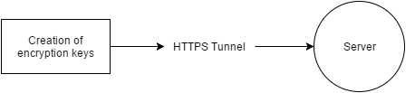
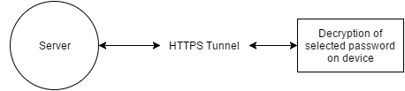

Wi-Fi Password Database
=======================

for Android

Description
-----------

The Wi-Fi Password Database App allows you to securely sync your Wi-Fi passwords
to the ApexTech Solutions servers.

Security
--------

All data is stored, processed and managed with AES-256 bit encryption.
Encryption keys are generated when your account is created and stored with
AES-256 bit encryption on our servers.

*Initial account creation*

*Data transfer to and from server*

